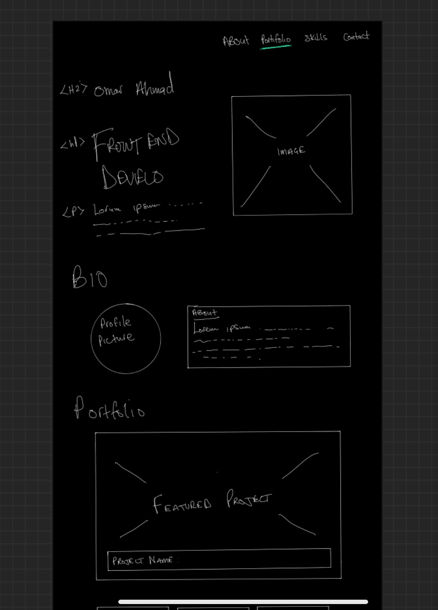
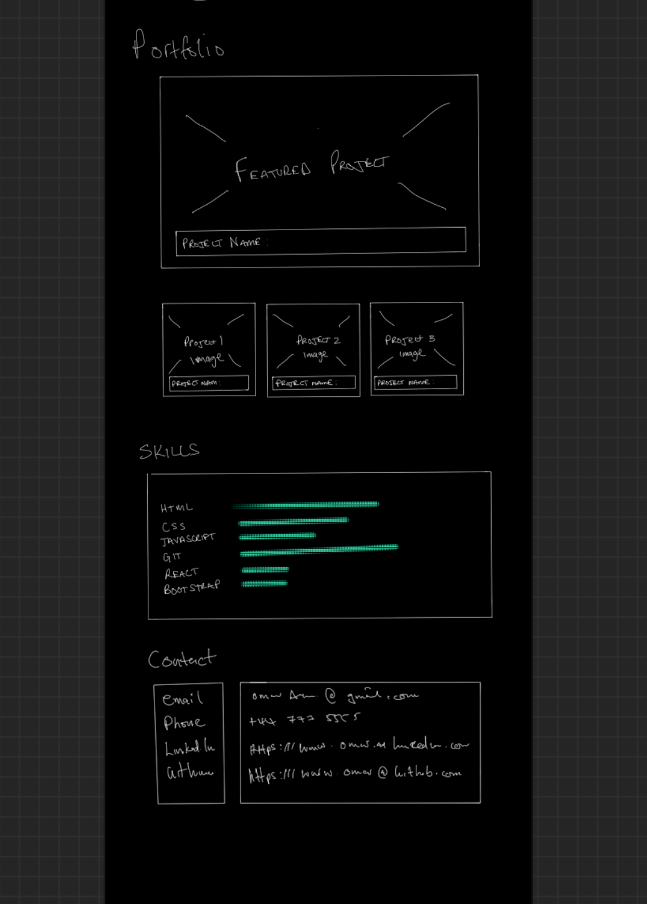

# Portfolio-Challenge

## Table of contents

- [Objective](#Project-objective)
- [Acceptance criteria](#Description)
- [Thought Process](#Thought-process)
- [Wireframe design](#Initial-wireframe-design)
- [Resources & tools](#Resources)
- [Credits](#Credits)
- [License](#License)

## Deployed site 

## Project objective
- The challenge is to create a personal portfolio page that you can update throughout the bootcamp with skills and details you learn as you progress through the modules.
## Description

Acceptance criteria:

- When the page is loaded the page presents your name, a recent photo or avatar, and links to sections about you, your work, and how to contact you

- When one of the links in the navigation is clicked then the UI scrolls to the corresponding section

- When viewing the section about your work then the section contains titled images of your applications

- When presented with the your first application then that application's image should be larger in size than the others

- When images of the applications are clicked then the user is taken to that deployed application

- When the page is resized or viewed on various screens and devices then the layout is responsive and adapts to my viewport.

## Thought Process
 
 I wanted to create a clean and simple layout with advanced functionality to navigate my site as it will be built on over the course of the bootcamp.

I want to incorporate unique design elements and a standout factor to attract potential future clients.

My interest in design has been a contributing factor on how I see layouts and what I want my work to present.

Improvements I will look to make would be to add a hamburger menu when viewed in a small screen size and incorporate icons and additional advanced features.

As I have not yet been introduced to bootstrap and icons in my contact section I substituted this for a way to display an image which links to my contact info.
## Initial Wireframe Design

I created my wireframe design using Procreate on Ipad Pro.

I did a mock up of how I wanted to structure the page to give a look and feel of the end result.

Check out my initial layout below

Screenshot 1:

Screenshot 2:

## License

Please refer to the LICENSE in the repo